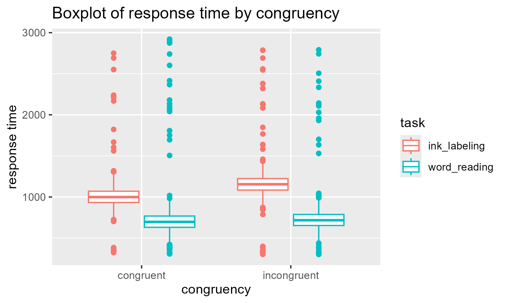

# Stroop-Analysis-for-Assignment
This is an example repository for R course assignment

## General Description
this is the analysis of a Stroop experiment

## Example Figure
this is a boxplot figure of response time-congruency

